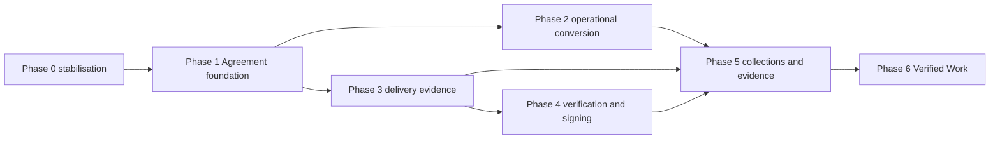

# Agreements execution roadmap

Status: proposed sequence
Delivery style: independently shippable, feature-flagged phases inside the existing modular monolith

## Dependency map

Do not use calendar dates as dependencies. A phase is complete when its acceptance criteria and migration/rollback evidence are complete.

## Phase 0 — stabilisation

### Objective

Make the current Contracts workflow safe to extend and safe to stop. Establish state, ownership, test, migration, and observability baselines.

### Scope

- audit and freeze schema drift;
- formalize current live status machine including `starting`;
- centralize and call transition guards;
- add authorization regression matrix;
- label current signing as recorded/first-party and gate local provider in production;
- add public-link access/rate-limit telemetry;
- add idempotency design for high-risk writes;
- quarantine or document the missing provider callback;
- feature flags for structured reads, verification, generation, and evidence exports.

### Likely files/modules affected

- `src/utils/contracts.ts`, `src/utils/rateLimit.ts`, `src/utils/esign.ts`;
- `src/app/api/workflow/contracts/**`, `src/app/api/public/contracts/**`;
- `src/app/api/contracts/maintenance/route.ts`;
- `prisma/schema.prisma` only for nullable telemetry/idempotency fields;
- `tests/e2e/contracts-ux.spec.ts`, `scripts/smoke-contracts.mjs`, new domain tests;
- `infrastructure/aws/jobs.tf`, environment/SSM flag configuration.

### Schema/API/frontend/migration work

- no destructive schema changes;
- central status/error codes and expected-version headers;
- explicit link purpose/acceptance method in responses;
- surface “recorded acceptance” copy and verification status;
- data discovery queries and migration run record.

### Tests and dependencies

- state, authorization, link, concurrency, and smoke baselines;
- depends only on current repository and database;
- legal review of current consent/product wording is a dependency for production claims.

### Risks and rollback

- risk: transition guard breaks a legacy edge path; mitigate by running smoke and logging blocked transitions;
- rollback: disable flags/revert route calls; no historical rows are deleted.

### Acceptance criteria

- `starting` is declared and every current transition has one authoritative rule;
- all Contract routes enforce `userId`/workspace ownership;
- current smoke script and existing Playwright tests pass;
- no production route advertises OTP/provider-backed signature without configured adapter;
- migration discovery report is available.

## Phase 1 — Agreement foundation

### Objective

Introduce Agreement domain language, structured canonical versions, immutable render artifacts, secure review links/sessions, basic recorded acceptance, and append-only events without breaking Contract URLs.

### Scope

- Agreement repository/application services;
- structured parties/sections/milestones/payment terms/attachments;
- version reason/diff/canonical/render hashes;
- secure public session exchange and public payload minimization;
- recorded acceptance adapter and clear consent text;
- event sequence/hash and outbox intent;
- durable private PDF/object storage.

### Likely files/modules affected

- new `src/modules/agreements/**` tested modules;
- compatibility adapters under `src/utils/contracts.ts`;
- existing Contract route handlers and public pages;
- `prisma/schema.prisma` and additive migrations;
- `src/utils/contractPdf.tsx`, `src/app/api/uploads/presign/route.ts`, private asset route;
- notification/email outbox worker.

### Schema/API/frontend/migration work

- add structured child tables and sessions;
- keep `contracts`/IDs/URLs;
- add Agreement-native API aliases and version serializers;
- show version/revision reason/render hash and acceptance method;
- add attachment manifest UI only after storage scan path exists.

### Tests and dependencies

- version immutability, stale link, session, artifact hash, payload minimization, migration backfill;
- depends on Phase 0 and storage/retention decisions;
- legal review of recorded acceptance text.

### Risks and rollback

- risk: JSON/structured drift; dual-read compare and quarantine;
- risk: object-storage misconfiguration; keep accepted state and retry artifact job;
- rollback: feature-flag structured reads; legacy Contract reads remain.

### Acceptance criteria

- every newly created version has structured rows and immutable canonical/rendered hashes;
- accepted version cannot be modified through app or runtime DB role;
- review sessions/links are purpose/version/recipient-scoped;
- current URLs continue to function;
- basic recorded acceptance is not described as OTP or regulated signature.

## Phase 2 — operational conversion

### Objective

Turn an accepted Agreement into a deterministic project plan without duplicate records or silent legal mutation.

### Scope

- generation preview and confirm;
- client/project/milestone/task/calendar projection;
- budget and invoice schedule projection;
- deposit invoice policy;
- `ProjectGenerationRecord`, idempotency, transactional side effects/outbox;
- accepted-vs-operational divergence warnings.

### Likely files/modules affected

- new `src/modules/agreements/application/project-generation.ts`;
- `src/app/api/workflow/projects/**`, calendar outbox, invoices;
- `src/app/(dashboard)/workflow/contracts/[id]/page.tsx` or Agreements detail;
- Prisma migration for generation/projection link tables.

### Schema/API/frontend/migration work

- add generation record and agreement milestone/payment term links;
- add preview/execute/retry endpoints;
- add “Generated from Agreement vN” source links in project/milestone/invoice UI;
- backfill only links that can be proven; do not infer past generation.

### Tests and dependencies

- Flow C, concurrency/partial failure/idempotency, calendar/invoice projection;
- depends on Phase 1 structured accepted versions and existing calendar/invoice APIs;
- founder decision on auto-generate vs confirmation.

### Risks and rollback

- risk: duplicate operational rows; unique natural keys and generation record;
- risk: project edits appear contractual; divergence warnings and amendment gate;
- rollback: disable execute, retain generation audit and allow manual reconciliation.

### Acceptance criteria

- deterministic preview matches generated records;
- repeated execution creates no duplicates;
- accepted version never changes from project/task/calendar edits;
- each projection has source Agreement/version link and error/retry state.

## Phase 3 — delivery evidence

### Objective

Make “what was delivered and approved” first-class evidence.

### Scope

- deliverable definitions and submissions;
- file/link/notes manifest and hashes;
- client review, approval, rejection, revision reason/count;
- formal change requests;
- amendments with re-acceptance and projection updates;
- evidence timeline.

### Likely files/modules affected

- new delivery/agreement modules and routes;
- `src/app/api/workflow/milestones/[id]/route.ts` compatibility commands;
- new public client review/submission endpoints and UI;
- file upload/scanning/storage modules;
- Prisma migrations.

### Schema/API/frontend/migration work

- add submissions/reviews/change_requests/amendments tables;
- separate milestone completed from client approved;
- update billing eligibility only from approved event according to term;
- preserve current boolean milestone behavior as a legacy/manual projection.

### Tests and dependencies

- Flow D/E, file integrity, public client review, revision cap, change/amendment race tests;
- depends on Phase 1 structured terms and Phase 2 links;
- legal review of acceptance criteria and revision/cancellation clauses.

### Risks and rollback

- risk: client UX too heavy; keep low-friction public review session;
- risk: files become a new attack surface; scan/quarantine before availability;
- rollback: disable client approval automation; retain submitted evidence.

### Acceptance criteria

- no invoice eligibility from task completion alone when an Agreement requires approval;
- approval event identifies the version/submission/approver/time;
- scope changes cannot exist only in comments/tasks;
- amendment preserves historical accepted data.

## Phase 4 — verification and signing

### Objective

Support production-grade identity/verification options behind a provider-neutral boundary.

### Scope

- acceptance-provider interface and registry;
- email/phone OTP adapter as approved;
- external e-sign adapter readiness;
- provider webhooks/raw-body signature validation;
- challenge replay/brute-force controls;
- provider evidence mapping and reconciliation.

### Likely files/modules affected

- `src/utils/esign.ts` extraction to acceptance adapters;
- new provider modules/webhook routes;
- public acceptance UI/API;
- acceptance attempts/acceptances/provider event tables;
- secret/SSM configuration and monitoring.

### Schema/API/frontend/migration work

- add provider-neutral acceptance records; retain legacy signatures;
- expose method/provider/result labels and current version hash;
- add resend/verify/status UX with safe errors.

### Tests and dependencies

- provider fakes, webhook signature/replay, OTP abuse, provider outage, Flow A/B;
- depends on Phase 1 public sessions and legal/identity provider decision;
- external vendor contract/security review.

### Risks and rollback

- risk: vendor state diverges; reconciliation worker and manual recovery;
- risk: overclaiming legal status; provider-specific copy and legal review;
- rollback: disable provider method; keep pending, do not downgrade accepted records.

### Acceptance criteria

- no acceptance without configured method requirements;
- duplicate/replayed provider events are harmless;
- provider outage never creates false acceptance;
- all public acceptance attempts are rate-limited/audited.

## Phase 5 — collections and evidence

### Objective

Connect contractual obligations to collections evidence without conflating invoice/payment/contract states.

### Scope

- deposit/milestone/fixed/recurring/final schedule;
- tax/currency policy;
- reminders/overdue workflow;
- validated payment events and provider reconciliation;
- asynchronous evidence-pack export/private download;
- counsel-reviewed declarations/templates.

### Likely files/modules affected

- `src/utils/contractBilling.ts`, invoice routes, payment/provider adapters;
- new outbox/reminder/evidence workers;
- evidence pack routes/UI;
- object storage/retention/permissions;
- Prisma migrations.

### Schema/API/frontend/migration work

- add `agreement_invoice_links`, payment events, evidence exports, download audit;
- expose payment schedule and evidence timeline from Agreement detail;
- keep generated invoices reviewable before send unless policy explicitly says otherwise.

### Tests and dependencies

- Flow F, invoice/payment idempotency, reminder/delivery retries, hash/manifest tests;
- depends on Phase 2/3/4 and tax/payment/legal decisions;
- finance/accounting review.

### Risks and rollback

- risk: financial duplication or false paid status; strict unique keys and separate payment state;
- risk: evidence PII leakage; role/minimized export and signed URLs;
- rollback: stop exports/reminders/generation; retain existing records and download expiry.

### Acceptance criteria

- every invoice/payment/evidence side effect has source Agreement event/link;
- duplicate workers produce one occurrence/invoice/export;
- evidence pack hash and manifest are reproducible;
- public copy makes no admissibility guarantee.

## Phase 6 — Verified reputation

### Objective

Create privacy-safe, client-approved proof of successful work.

### Scope

- Verified Work records;
- client approval of public fields;
- public verification badge/link;
- dispute/revocation/privacy controls;
- optional testimonial/revenue range/completion date.

### Likely files/modules affected

- `src/app/api/portfolio/**`, portfolio UI/renderer;
- Verified Work schema/routes/public projection;
- client approval public UI;
- analytics and moderation tooling.

### Schema/API/frontend/migration work

- add `verified_work_records` with source Agreement/project/milestones and consent;
- do not copy private clauses/payment terms by default;
- allow revocation/expiry/dispute state.

### Tests and dependencies

- client/public privacy matrix, revocation/dispute, public payload and portfolio regression;
- depends on completed/approved delivery and legal/privacy decisions.

### Risks and rollback

- risk: publishing confidential/disputed work; explicit client fields/consent and safe defaults;
- rollback: unpublish projection without deleting underlying Agreement evidence.

### Acceptance criteria

- no Verified Work public by default;
- client-approved public fields are separately stored and auditable;
- dispute/revocation removes public badge without mutating Agreement evidence.

## Granular engineering backlog

Each item is intended to fit one focused implementation session or pull request. `P0` blocks safe production use; `P1` is required for the next broad release; `P2` is important expansion; `P3` is later enhancement.

| ID | Priority | Class | Backlog item | Depends on |
| --- | --- | --- | --- | --- |
| AGR-001 | P0 | security/backend | Add `starting` to the current status registry and central transition matrix. | none |
| AGR-002 | P0 | backend/testing | Replace direct Contract state writes in current routes with the shared transition guard. | AGR-001 |
| AGR-003 | P0 | security/testing | Add two-user ownership matrix for all Contract/public/artifact routes. | none |
| AGR-004 | P0 | security/backend | Fail closed when production lacks a strong `SESSION_SECRET`; rotate/revoke session plan. | none |
| AGR-005 | P0 | security/infrastructure | Move public-link rate limits from process memory to a shared production adapter. | none |
| AGR-006 | P0 | product/legal | Replace unsupported signature/legal claims with method-specific reviewed copy. | founder/legal |
| AGR-007 | P1 | database/migration | Add migration-run/data-discovery report and quarantine status for legacy Contracts. | AGR-003 |
| AGR-008 | P1 | backend | Create Agreement repository/application command boundary over current `contracts` tables. | AGR-001, AGR-003 |
| AGR-009 | P1 | database | Add version revision reason, schema version, expected-version, and nullable rendered-artifact metadata. | AGR-007 |
| AGR-010 | P1 | backend/testing | Add canonical structured version serializer/diff with stable hash fixtures. | AGR-009 |
| AGR-011 | P1 | database/migration | Add structured party/section/payment child tables and batch backfill. | AGR-010 |
| AGR-012 | P1 | backend/testing | Dual-read legacy JSON versus structured version and alert on material drift. | AGR-011 |
| AGR-013 | P1 | backend/security | Exchange link tokens for purpose-bound public sessions and redact public payloads. | AGR-005, AGR-011 |
| AGR-014 | P1 | backend/database | Add append-only event sequence/hash fields and single event writer. | AGR-008 |
| AGR-015 | P1 | infrastructure/backend | Persist rendered PDF bytes with immutable object key and rendered hash. | AGR-009 |
| AGR-016 | P1 | backend/testing | Add idempotency-key storage/response replay for review, version, acceptance, and artifact commands. | AGR-008 |
| AGR-017 | P1 | backend | Add provider webhook callback route with raw-body signature verification seam. | AGR-016 |
| AGR-018 | P1 | testing | Add race tests for accept/decline/void/version edit and concurrent billing. | AGR-002, AGR-016 |
| AGR-019 | P1 | product/design | Add Agreement detail timeline for version/hash/link/acceptance events. | AGR-014 |
| AGR-020 | P1 | migration | Preserve existing `/contracts` API/UI through compatibility serializers and redirects only after parity. | AGR-012 |
| AGR-021 | P1 | backend/database | Add `project_generation_records` and deterministic preview command. | AGR-011 |
| AGR-022 | P1 | backend | Implement idempotent project/milestone/task/calendar/invoice schedule execution. | AGR-021 |
| AGR-023 | P1 | frontend/design | Add project-generation preview/confirmation UX and source links. | AGR-022 |
| AGR-024 | P1 | testing | Production-block Flow C with retry/concurrency/partial failure assertions. | AGR-022 |
| AGR-025 | P2 | database/backend | Add agreement milestone/deliverable definition and operational links. | AGR-011, AGR-022 |
| AGR-026 | P2 | backend/frontend | Add submission, file manifest, revision request, and client review/approval commands. | AGR-025, storage |
| AGR-027 | P2 | security/infrastructure | Add malware scanning/quarantine and private Agreement attachment storage. | storage/legal |
| AGR-028 | P2 | backend | Make invoice eligibility derive from approval event where Agreement requires it. | AGR-026 |
| AGR-029 | P2 | product/design | Add formal change-request inbox and impact preview. | AGR-025 |
| AGR-030 | P2 | backend/database/legal-review dependency | Add amendment version/acceptance and approved projection updates. | AGR-029, legal |
| AGR-031 | P1 | backend/security | Implement provider-neutral acceptance/verification interfaces and recorded adapter. | AGR-013 |
| AGR-032 | P1 | backend | Add email OTP adapter with hashed code, attempt/cooldown, provider delivery record. | AGR-031, legal |
| AGR-033 | P1 | backend/security | Add provider webhook event dedupe and reconciliation worker. | AGR-017, AGR-031 |
| AGR-034 | P1 | testing | Production-block Flows A/B with OTP/provider fakes and stale-link races. | AGR-032/33 |
| AGR-035 | P2 | backend/database | Add tax/payment-term occurrence model and Agreement-invoice link. | finance |
| AGR-036 | P2 | backend | Add payment event/manual receipt model; prohibit generic paid status without source policy. | AGR-035, finance |
| AGR-037 | P2 | infrastructure/backend | Add outbox worker for email, reminders, calendar, artifacts, and exports. | AGR-014 |
| AGR-038 | P2 | backend | Add evidence export job/manifest/object storage/expiry/download event. | AGR-015, AGR-014 |
| AGR-039 | P2 | security/testing | Add evidence-export role matrix, PII redaction, retention/legal-hold tests. | AGR-038, legal |
| AGR-040 | P2 | testing | Production-block Flows D/E/F against real PostgreSQL and object/provider fakes. | AGR-026, AGR-030, AGR-038 |
| AGR-041 | P3 | database/backend | Add workspace/membership/role migration from single-user `userId`. | founder/team decision |
| AGR-042 | P3 | security/frontend | Add delegated agency signatory/billing contact and role-scoped PII. | AGR-041 |
| AGR-043 | P3 | database/frontend | Add client-approved Verified Work record and safe public projection. | AGR-026, completed |
| AGR-044 | P3 | product/legal | Add public verification badge, revocation, dispute/privacy controls. | AGR-043, legal |
| AGR-045 | P3 | analytics | Add Agreement funnel, delivery approval, collection, evidence, and Verified Work metrics. | AGR-019, AGR-040 |
| AGR-046 | P3 | migration | Optional physical `contracts` to `agreements` rename/view after compatibility parity. | AGR-020, AGR-041 |

## First implementation recommendation

Implement AGR-001 through AGR-003 as one safe foundation slice: state registry + transition matrix + current route enforcement + regression coverage. It changes no public URL, does not replace the schema, and directly protects every later Agreement phase. AGR-004 is the next security slice after confirming how deployed secrets are managed in AWS SSM.
