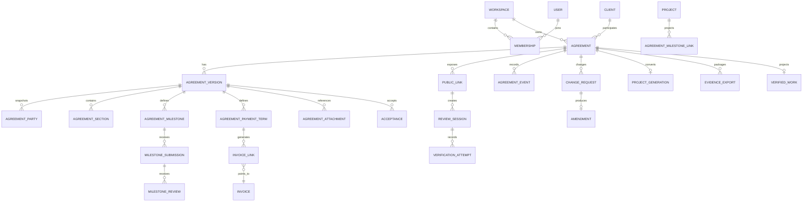
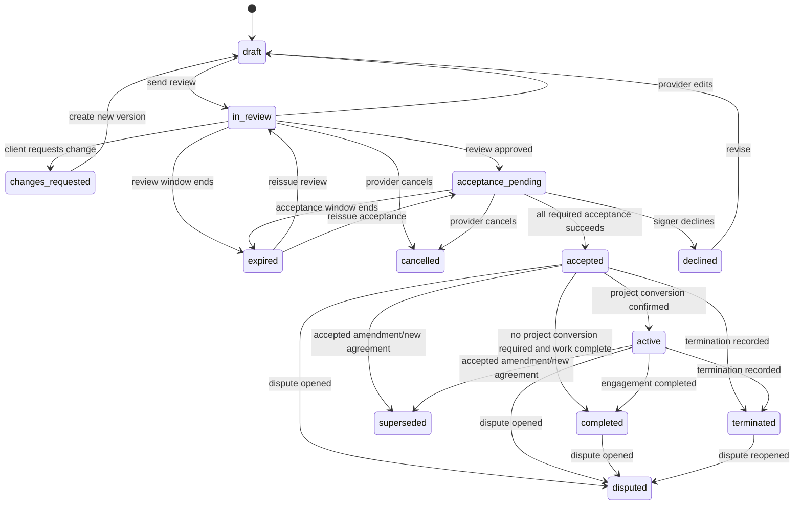
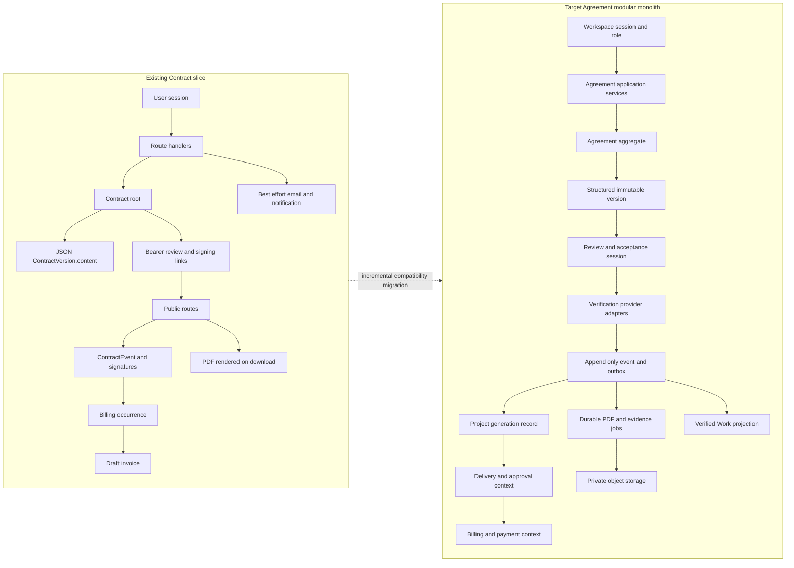
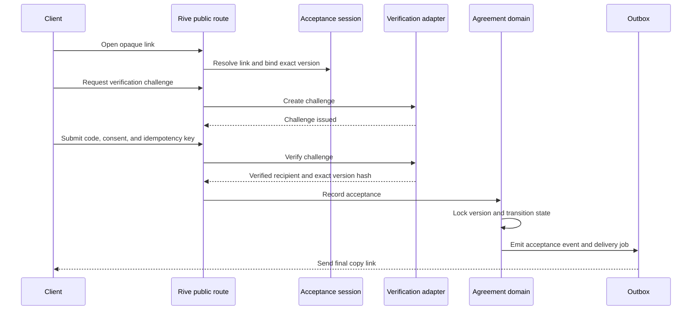
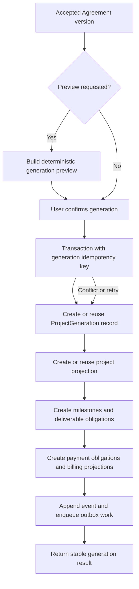
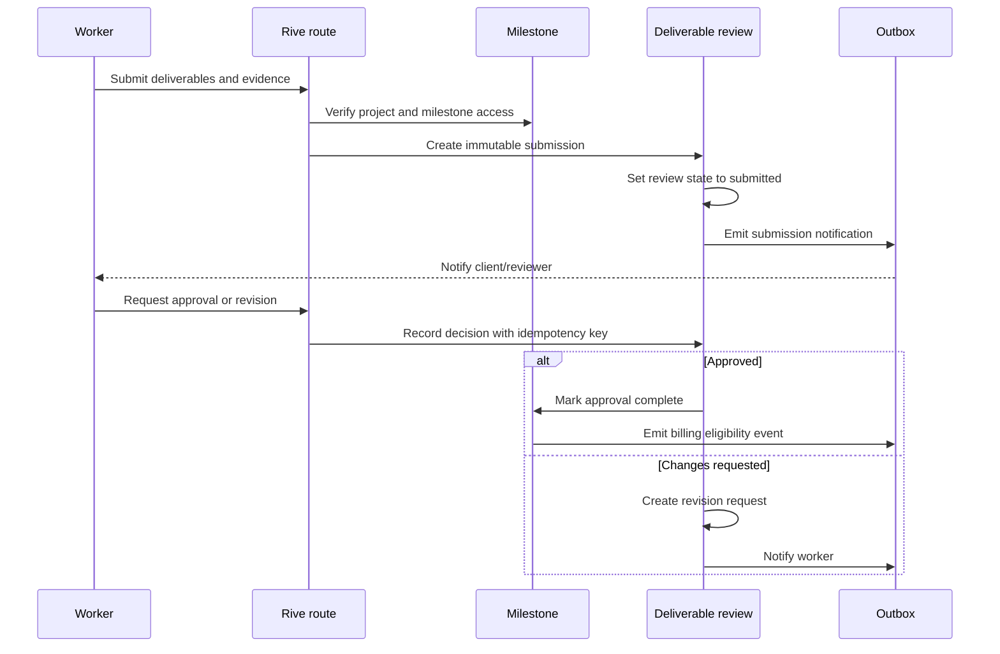
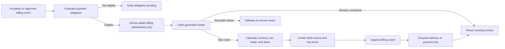
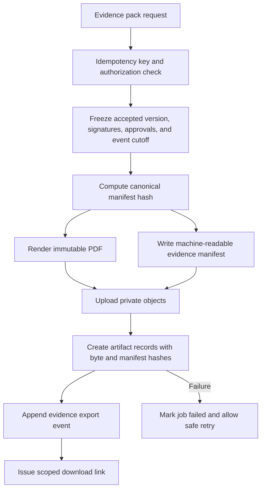

# Agreements target architecture

Status: proposed modular-monolith target
Runtime: Next.js 16 App Router, Prisma 7, PostgreSQL, AWS deployment

## Architecture direction

Keep the existing Rive modular monolith. The target is a set of explicit modules and transaction boundaries inside the current app, not a network of premature microservices. Agreement routes should be thin adapters around domain/application services. Domain rules must be testable without React, provider SDKs, or HTTP.

The initial compatibility domain is named `Agreement` in application code and may continue mapping to the physical `contracts` table until the migration is proven. Existing `/workflow/contracts`, `/review/[token]`, and `/sign/[token]` URLs remain compatibility routes.

## Bounded contexts

| Context | Owns | Does not own |
| --- | --- | --- |
| Identity & Workspace | users, workspaces, memberships, roles, session/auth policy | Agreement content or provider ceremonies |
| CRM | clients, companies, contacts, signatory candidates, billing contacts | accepted snapshots |
| Agreements | aggregate state, versions, parties, clauses, links, acceptance, amendments, events | provider SDK internals, invoice accounting ledger |
| Delivery | projects, milestones, tasks, submissions, reviews, approvals | rewriting accepted terms |
| Billing | payment terms, invoice eligibility, invoices, deliveries, payment events | deciding contractual acceptance |
| Files & Documents | private objects, hashes, PDF rendering, document manifests | Agreement state transitions |
| Communications | notification intents, email delivery, reminders, provider callbacks | changing domain state without a command |
| Evidence & Reputation | evidence exports, verified-work projections, client publication consent | exposing private contract terms by default |

## Domain/entity relationships



## Agreement aggregate and invariants

The application aggregate contains the root plus the current version reference, parties, links, payment terms, and state. It exposes commands such as:

- `createDraft(input)`;
- `createVersion(input, reason)`;
- `openReview(versionId, recipient)`;
- `requestChanges(session, payload)`;
- `startAcceptance(versionId, providerPolicy)`;
- `recordAcceptance(challenge, evidence)`;
- `cancel()`;
- `createAmendment(baseVersionId, input)`;
- `generateProjectProjection(acceptedVersionId, idempotencyKey)`.

Important invariants are checked both in the application service and database constraints:

- every aggregate is owned by one workspace;
- every related client/project/milestone/file is workspace-consistent;
- only one current version is actionable;
- accepted versions are immutable;
- links are purpose/version/signer-scoped and only one active rotation exists per purpose/recipient;
- acceptance references the exact version hash and cannot be replayed;
- payment-term occurrence keys are unique;
- project generation is unique per accepted version;
- event sequence/hash is monotonic per aggregate.

## Lifecycle state machine



`viewed`, `verification_succeeded`, `deliverable_approved`, and `invoice_generated` are events, not states. Application code must use one transition map; raw status writes are prohibited outside the Agreement state service and controlled migrations.

## Service/module boundaries

Suggested application modules under `src/modules/agreements/`:

```text
agreements/
  domain/
    agreement.ts
    agreement-status.ts
    agreement-version.ts
    agreement-errors.ts
  application/
    create-draft.ts
    create-version.ts
    review.ts
    acceptance.ts
    amendments.ts
    project-generation.ts
    evidence-export.ts
  infrastructure/
    agreement-repository.ts
    event-store.ts
    public-link-repository.ts
    acceptance-provider-registry.ts
    pdf-renderer.ts
    object-storage.ts
  api/
    serializers.ts
    authorization.ts
```

The current files `src/utils/contracts.ts`, `src/utils/esign.ts`, `src/utils/contractBilling.ts`, and `src/utils/contractPdf.tsx` are compatibility seams to extract gradually. Do not create an empty module tree; each extraction should move a tested rule or integration.

## API design

Keep Route Handlers as HTTP adapters with async `params` per Next.js 16.

### Authenticated endpoints

```text
GET    /api/workflow/agreements
POST   /api/workflow/agreements
GET    /api/workflow/agreements/:id
POST   /api/workflow/agreements/:id/versions
POST   /api/workflow/agreements/:id/review-sessions
POST   /api/workflow/agreements/:id/acceptance-sessions
POST   /api/workflow/agreements/:id/cancel
POST   /api/workflow/agreements/:id/amendments
POST   /api/workflow/agreements/:id/project-generation/preview
POST   /api/workflow/agreements/:id/project-generation/execute
POST   /api/workflow/agreements/:id/evidence-exports
GET    /api/workflow/agreements/:id/events
```

Compatibility aliases keep `/api/workflow/contracts*` and existing UI links working during migration.

### Public endpoints

```text
GET    /api/public/agreements/:token
POST   /api/public/agreements/:token/comments
POST   /api/public/agreements/:token/change-requests
POST   /api/public/agreements/:token/verification/challenge
POST   /api/public/agreements/:token/verification/verify
POST   /api/public/agreements/:token/accept
GET    /api/public/agreements/:token/artifact
POST   /api/public/agreements/provider-webhooks/:provider
```

All mutations accept an `Idempotency-Key` header. The key is scoped to workspace/action/actor and stores the response envelope for safe retries. Public mutations also require a short-lived public session derived from the opaque link.

## Authorization strategy

Every authenticated repository method requires a `workspaceId` derived from the trusted session and every query includes it. Never accept workspace/user ownership from request JSON.

Minimum roles:

| Role | View | Edit draft | Send/accept/cancel | Export evidence | Manage templates/members |
| --- | --- | --- | --- | --- | --- |
| `owner` | yes | yes | yes | yes | yes |
| `admin` | yes | yes | yes by policy | yes | limited |
| `member` | assigned/allowed | assigned drafts | no by default | no by default | no |
| `finance` | commercial fields | no scope edits | send/reminders/payment | limited | no |
| `viewer` | allowed records | no | no | no | no |

Client-side hiding is only UX. Server authorization checks workspace membership, role, record assignment, and sensitive field scope. Public sessions never inherit internal workspace permissions.

## Public-link architecture

```text
opaque token -> HMAC/hash lookup -> link purpose/version check
  -> rate limit / abuse budget
  -> public session cookie (hash stored server-side)
  -> optional OTP/provider challenge
  -> command with expected version + idempotency key
  -> append-only event + response
```

Tokens are generated with a CSPRNG, hashed with a server secret, never logged, and never returned from database serializers. Links are revocable and rotated on every material version change. Use a distributed store for rate limits/session throttles in production; the current process-local `Map` is only a development fallback.

## Verification-provider abstraction

Provider-specific adapters live behind `AcceptanceProvider`. The domain records `method`, `provider`, `providerReference`, `consentTextVersion`, `documentHash`, `result`, and sanitized provider metadata. Webhooks are verified against the raw body/signature, deduplicated by provider event ID, and converted into domain commands. Provider outage leaves the Agreement in `acceptance_pending` with a retryable failure, never `accepted`.

## PDF/document architecture

1. Validate structured canonical version.
2. Build a deterministic render model (stable ordering, locale, currency, dates, clause/template versions).
3. Render on the server using the current PDF utility or a dedicated worker.
4. Compute `canonicalHash` and `renderedHash` from bytes.
5. Store PDF bytes in private object storage with immutable/versioned key.
6. Store a `DocumentArtifact` manifest with size, MIME, storage key, hashes, renderer version, and generation time.
7. Serve via an authorized short-lived signed object URL or streamed route.

The canonical version remains authoritative. A PDF is never regenerated on download for an accepted version unless a new artifact with a new renderer version is explicitly created and recorded.

## Background jobs and outbox

Use synchronous PostgreSQL transactions for state changes and an `agreement_outbox`/shared outbox row in the same transaction for:

- email/notification intents;
- calendar projection;
- PDF rendering;
- evidence export;
- provider reconciliation;
- reminder schedules.

Workers claim rows with `SELECT ... FOR UPDATE SKIP LOCKED`, lease/attempt fields, exponential backoff, and a dead-letter/alert path. Existing AWS EventBridge/Lambda HTTP runner can invoke a bounded worker endpoint during migration; durable work should not depend on a single long request.

## Notification architecture

Domain event -> outbox intent -> communication worker -> provider delivery record -> retry/reconciliation.

Each delivery has a dedupe key such as `agreement:${id}:version:${versionId}:review_invitation:${recipient}`. Email templates carry the exact version number/hash and clear legal/product language. Client notifications are opt-in and never include full contract content in subject/preview metadata.

## File/object-storage architecture

- private bucket/prefix per workspace and purpose;
- server-issued upload intent with file size/MIME/extension and malware scanning status;
- random object keys; no user filenames in authorization keys;
- `AgreementAttachment` manifest with creator, version, visibility, bytes, MIME, content hash, scan status, and immutable accepted-version reference;
- signed URLs with short expiry and download audit events;
- retention/legal-hold policy by workspace/record state;
- reject active/macro archives and validate MIME by content signature, not only browser headers.

## Audit strategy

Use one domain event writer. Event rows contain an aggregate-local sequence, type/version, actor subject, request ID, timestamps, sanitized metadata, previous hash, event hash, and optional provider event ID. Events are not updated/deleted through normal APIs. DB privileges should grant insert/select to the application writer and deny update/delete to the runtime role where practical. Retention deletion must create a separately controlled deletion record and be reviewed for legal holds.

The hash chain is tamper-evident. It is not a blockchain and does not itself establish legal admissibility.

## Observability

Every Agreement command carries:

- `requestId`/correlation ID;
- workspace/Agreement/version IDs (not public tokens);
- actor role and provider name;
- transition from/to;
- latency and outcome;
- idempotency key hash;
- job attempt and provider request ID.

Metrics:

- transition failures by state/reason;
- public-link 404/410/429 rates;
- verification success/failure/latency;
- provider webhook lag/duplicate/outage;
- outbox backlog/dead letters;
- PDF/evidence success/failure and byte size;
- duplicate-prevention conflicts;
- invoice eligibility/generation/send/payment lag.

Do not log raw tokens, OTPs, full IPs, user-agent strings, provider secrets, full agreement content, or attachment bytes.

## Failure handling and retries

| Failure | Required behavior |
| --- | --- |
| DB transaction conflict | Return retryable conflict; caller re-fetches current state. |
| Duplicate request | Return stored idempotent response; no duplicate side effects. |
| Email failure | Keep domain event; outbox retries; expose delivery status. |
| Provider timeout | Keep `acceptance_pending`; retry/cancel safely; do not accept. |
| Provider duplicate webhook | Deduplicate by provider event ID; return 2xx after safe no-op. |
| PDF failure | Keep accepted state; mark artifact job failed; expose retry; no mutable placeholder artifact. |
| Object upload failure | Keep manifest `pending`/`failed`; do not expose partial file. |
| Worker crash | Lease recovery; idempotency key and unique constraints prevent duplicates. |
| Project generation partial success | Record every projection; resume or compensate by generation record. |
| Dispute opened | Stop automatic “completed”/collection mutations according to policy; preserve evidence. |

## Data retention and privacy

Classify agreement content, party PII, verification metadata, files, event metadata, and evidence exports separately. Default public views should omit phone, full address, raw IP, user-agent, provider payload, and internal IDs unless the recipient has a verified need. Store only hashed network/device values where sufficient; retain raw provider evidence only in restricted storage if required by provider/legal policy. Define retention by agreement status, plan, jurisdiction, legal hold, and client deletion request.

## Existing versus target architecture



## Client acceptance sequence



## Agreement-to-Project generation



## Milestone submission and approval



## Invoice generation



## Evidence-pack generation



## Architecture acceptance criteria

- Every Agreement mutation is an authorized command with a transition test.
- Accepted version canonical and rendered hashes are stable and retrievable.
- Public link access cannot enumerate workspace data and is rate-limited across instances.
- Verification provider code is replaceable without changing the Agreement aggregate.
- Repeated project generation/invoice generation/evidence export requests are idempotent.
- Contract content, operational changes, approvals, payments, and evidence are separate but linked concepts.
- No user-visible copy makes unsupported legal/e-signature claims.
